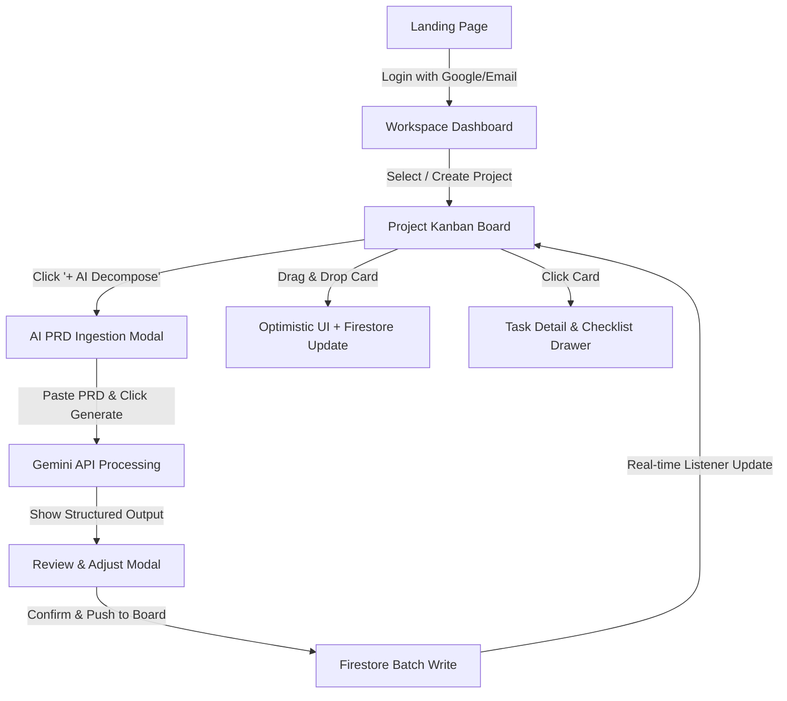

# Product Requirement Document (PRD)
## Project Name: SprintCraft AI
### Tagline: AI-Powered Sprint Planner & Real-Time Collaborative Kanban Board
**Author:** Candidate (Fullstack Engineering Intern)  
**Target Audience:** Engineering Leads, Tech Recruiters, Product Managers  
**Status:** In-Design / Planning  

---

## 1. Executive Summary & Value Proposition

### 1.1 Latar Belakang Masalah
Software development team sering menghabiskan waktu berjam-jam dalam sesi *Sprint Planning* dan *Backlog Refinement* hanya untuk:
1. Membaca Product Requirement Document (PRD) yang panjang.
2. Memecah fitur menjadi User Stories, Acceptance Criteria (AC), dan subtasks teknis.
3. Memperkirakan Story Points dan dependensi antar tugas.
4. Menginput satu per satu tiket ke dalam papan Kanban.

### 1.2 Solusi: SprintCraft AI
**SprintCraft AI** adalah platform manajemen proyek modern yang menggabungkan kekuatan **Google Gemini AI** dengan **Real-Time Collaboration (Firebase Firestore)**:
- Developer/PM cukup menempelkan teks PRD atau deskripsi fitur mentah.
- AI secara otomatis membedah PRD menjadi struktur hierarki: **Epics → User Stories → Actionable Engineering Tasks** lengkap dengan *Acceptance Criteria*, *Story Points*, dan *Labels*.
- Hasil generate langsung terintegrasi ke dalam **Papan Kanban Interaktif** yang tersinkronisasi secara instan (real-time) antar anggota tim dengan animasi Drag-and-Drop yang mulus.

### 1.3 Mengapa Project Ini Menarik di Mata Recruiter/Tech Lead?
- **AI Structured Output**: Bukan sekadar chatbot, melainkan pipeline parsing JSON terstruktur menggunakan Gemini API dengan schema validation ketat.
- **Real-Time Distributed State**: Menggunakan Firestore snapshot listeners untuk sinkronisasi multi-klien tanpa perlu refresh.
- **Fluid Drag-and-Drop & Optimistic UI**: Menunjukkan pemahaman mendalam tentang frontend state management, micro-interactions, dan error recovery.
- **Clean Architecture & Security**: Backend Node.js modular, role-based security rules di Firestore, dan environment token protection.

---

## 2. User Personas

| Persona | Role | Pain Point | Ekspektasi Fitur |
| :--- | :--- | :--- | :--- |
| **Budi (Product Manager)** | PM Startup | Butuh waktu lama mengubah ide/PRD jadi tiket backlog di Jira/Trello. | Ingin 1-click breakdown PRD jadi User Stories terstandar. |
| **Siti (Tech Lead)** | Senior Dev | Task yang dibuat sering kurang detail kriteria teknis & estimasinya ngawur. | Butuh Acceptance Criteria dan estimasi story point otomatis sebagai acuan awal. |
| **Rian (Software Engineer)** | Junior/Intern | Bingung prioritas kerja dan sering conflict status task saat collab. | Kanban board yang live-update saat rekan kerja memindahkan task. |

---

## 3. Product Scope & Feature Specification

### 3.1 Core Features (MVP Scope)

#### F1: Authentication & Workspace Management
- **Auth Provider**: Google OAuth & Email/Password via Firebase Authentication.
- **Workspace**: Setiap user memiliki Workspace pribadi atau dapat bergabung ke Workspace tim via Invite Link / Code.
- **Session Persistence**: Auto token refresh & protected routes di React.

#### F2: AI PRD-to-Sprint Decomposition (Gemini AI Engine)
- **Input**: User menginput teks PRD, user requirement, atau upload file `.md`/`.txt`.
- **Custom Prompts & Controls**: User dapat memilih *Detail Level* (Concise, Detailed, Enterprise) dan *Focus Area* (Fullstack, Frontend-heavy, Backend-heavy).
- **Output Schema**:
  - **Epic Title & Description**
  - **User Stories** (Format: *As a [role], I want [feature] so that [benefit]*)
  - **Engineering Tasks**:
    - Title, Type (`Frontend`, `Backend`, `Database`, `DevOps`, `QA`)
    - Description & Technical Notes
    - Acceptance Criteria (List of checklist items)
    - Story Points (Fibonacci: 1, 2, 3, 5, 8, 13)
    - Priority (`Low`, `Medium`, `High`, `Urgent`)
- **Review & Edit Sebelum Simpan**: Modal preview interaktif di mana user bisa mencentang/menghapus task yang tidak relevan sebelum digenerate ke Board.

#### F3: Real-Time Kanban Board
- **Columns**: `Backlog`, `To Do`, `In Progress`, `In Review`, `Done`.
- **Drag-and-Drop**: Mulus menggunakan `@dnd-kit/core` dengan *optimistic UI updates* (UI berpindah seketika sambil menunggu respons database).
- **Live Sync**: Perubahan status, penambahan task, atau edit kartu langsung terefleksi ke semua user yang sedang membuka board secara *real-time* via Firestore `onSnapshot`.
- **Filters & Search**: Filter berdasarkan Priority, Assignee, Type (Frontend/Backend), dan Search keyword.

#### F4: Task Detail & Subtask Checklist
- Modal detail task yang kaya informasi:
  - Markdown-rendered description.
  - Interactive Acceptance Criteria checklist (status checklist tersimpan real-time).
  - Assignee avatar & story points badge.
  - Comments / Activity log per task.

#### F5: Export & Integration
- Export sprint board ke format **Markdown Tasklist**, **JSON**, atau salin langsung ke format **GitHub Issues**.

---

## 4. UI/UX Flow & Wireframe Layouts

### 4.1 User Flow Diagram


---

### 4.2 Wireframe & Screen Layouts

#### Screen 1: Kanban Board Utama (`/project/:id/board`)
```text
+---------------------------------------------------------------------------------------------------------+
|  [⚡ SprintCraft AI]    Project: E-Commerce Redesign    [👥 Team (4)]   [🔍 Filter]   [✨ AI Decompose]   |
+---------------------------------------------------------------------------------------------------------+
|                                                                                                         |
|  [ BACKLOG (3) ]         [ TO DO (2) ]          [ IN PROGRESS (2) ]    [ IN REVIEW (1) ]   [ DONE (4) ] |
|  +--------------------+  +--------------------+ +--------------------+ +-----------------+ +----------+ |
|  | #12 Setup Stripe   |  | #15 Auth Middleware| | #14 Product Filter | | #10 Cart Sync   | | #01 DB   | |
|  | [Backend] [High]   |  | [Security] [Med]   | | [Frontend] [High]  | | [Fullstack]     | |  Schema  | |
|  | 5 pts | 2/4 AC     |  | 3 pts | 0/2 AC     | | 8 pts | 3/5 AC     | | 5 pts | 4/4 AC  | |  Done ✅ | |
|  | 👤 Siti            |  | 👤 Rian            | | 👤 Budi            | | 👤 Siti         | |          | |
|  +--------------------+  +--------------------+ +--------------------+ +-----------------+ +----------+ |
|  | + Add Task         |  | + Add Task         | | + Add Task         | | + Add Task      | |          | |
|                                                                                                         |
+---------------------------------------------------------------------------------------------------------+
```

#### Screen 2: Modal AI PRD Decomposition (`Modal / Drawer`)
```text
+---------------------------------------------------------------------------------------------------------+
| ✨ AI Sprint Decomposer                                                                             [X] |
+---------------------------------------------------------------------------------------------------------+
| Paste your Product Requirements (PRD) or Feature Request:                                               |
| +-----------------------------------------------------------------------------------------------------+ |
| | Fitur Checkout & Pembayaran:                                                                        | |
| | User bisa memilih metode pembayaran (Transfer Bank & E-Wallet). Jika stok habis saat checkout,      | |
| | sistem harus menampilkan error popup dan mengembalikan keranjang. Kirim notifikasi email receipt.   | |
| +-----------------------------------------------------------------------------------------------------+ |
| Detail Level: [ (•) Standard (3-8 Tasks) ]  [ ( ) Deep Enterprise ]   Focus: [ Fullstack (Default) ▾ ]  |
|                                                                                                         |
|                                                [ Cancel ]  [ 🚀 Generate Backlog with Gemini ]          |
+---------------------------------------------------------------------------------------------------------+
| [PREVIEW RESULT: 4 Tasks Generated]                                                                     |
| [x] Task 1: [Backend] Integrate Midtrans/Xendit Payment Gateway (5 pts)                                 |
|     - AC: Endpoint `/api/checkout` validates inventory before creating invoice                          |
|     - AC: Webhook handler updates order status to 'PAID'                                                |
| [x] Task 2: [Frontend] Checkout Page & Payment Method Selector (3 pts)                                  |
| [x] Task 3: [Backend] Automated Email Receipt Dispatcher (2 pts)                                        |
|                                                                                                         |
|                                                               [ 📥 Add Selected Tasks to Board ]        |
+---------------------------------------------------------------------------------------------------------+
```

---

## 5. Technical Architecture & Database Design

### 5.1 System Architecture
- **Frontend**: React 18+ (Vite) + Tailwind CSS + Lucide Icons + `@dnd-kit/core` + Zustand (State Management).
- **Backend API**: Node.js (Express) untuk proxy aman ke Gemini API (menjaga `GEMINI_API_KEY` tetap aman di server) & export processor.
- **Database & Real-time**: Cloud Firestore.
- **Authentication**: Firebase Auth (Google & Email provider).
- **AI Model**: `gemini-1.5-flash` / `gemini-1.5-pro` dengan Structured JSON schema mode.

### 5.2 Firestore Data Schema
```json
// Collection: workspaces/{workspaceId}
{
  "name": "Acme Engineering",
  "ownerId": "user_abc123",
  "members": ["user_abc123", "user_def456"],
  "createdAt": "TIMESTAMP"
}

// Collection: projects/{projectId}
{
  "workspaceId": "workspace_1",
  "title": "E-Commerce Payment Redesign",
  "description": "Revamp payment flow with e-wallets",
  "columns": ["Backlog", "To Do", "In Progress", "In Review", "Done"],
  "createdAt": "TIMESTAMP"
}

// Collection: tasks/{taskId}
{
  "projectId": "project_1",
  "title": "Integrate Midtrans Payment Webhook",
  "description": "Handle incoming HTTP POST notification from gateway",
  "column": "To Do",
  "order": 1000,
  "storyPoints": 5,
  "priority": "High",
  "category": "Backend",
  "assignee": {
    "uid": "user_def456",
    "displayName": "Rian Dev",
    "photoURL": "https://..."
  },
  "acceptanceCriteria": [
    { "id": "ac_1", "text": "Verify SHA512 signature hash", "completed": true },
    { "id": "ac_2", "text": "Update order status to 'PAID' in DB", "completed": false },
    { "id": "ac_3", "text": "Idempotent handling for duplicate events", "completed": false }
  ],
  "aiGenerated": true,
  "createdAt": "TIMESTAMP",
  "updatedAt": "TIMESTAMP"
}
```

---

## 6. Fullstack Intern Resume & Interview Talking Points

Jika Anda membuat project ini dan menaruhnya di CV, berikut poin-poin emas yang bisa ditulis di bagian **Projects**:

> **SprintCraft AI | Fullstack Project Management & AI Sprint Decomposer**  
> *Tech Stack: React, Vite, Node.js, Express, Firebase Firestore, Firebase Auth, Google Gemini API, Tailwind CSS*  
> - Mengembangkan web app manajemen proyek kolaboratif *real-time* yang mengubah dokumen kebutuhan (PRD) menjadi *backlog engineering* terstruktur (Epics, Tasks, Acceptance Criteria) menggunakan Gemini API Structured Output.  
> - Mengimplementasikan papan Kanban interaktif dengan drag-and-drop dan *Optimistic UI Update*, tersinkronisasi secara live antar tim menggunakan Firestore snapshot listeners.  
> - Merancang arsitektur backend Node.js yang aman untuk orkestrasi prompt AI, sanitasi payload, dan integrasi Firestore batch writes untuk mencegah race-condition.  
> - Menerapkan sistem keamanan Firestore Security Rules berbasis Role-Based Access Control (RBAC) pada level workspace dan task.
